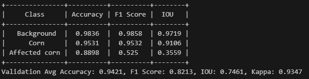

# ConvNeXtV2-Unet
ConvNeXtV2-Unet 结合 ConvNeXtV2 进行特征提取和 U-Net 进行图像分割，其中包含了栅格裁剪、划分数据集、训练可视化以及精度评价。
<<<<<<< HEAD

此项目用于玉米以及异常检测，针对航拍数据读取和精度评价做了对应优化，但针对异常玉米仍存在部分问题。


## What's New
- 2024.11.12：增加日志、数据增强部分。

## 使用方法
要使用该模型进行异常检测，请按照以下步骤操作：
1. Dataset：准备数据集，根据需求使用image_slice进行图片切片。
2. Dataloader：在train_ConvNext中修改你想要的data_aug和bs等超参。
3. train_ConvNext：对模型进行训练和评估，并将结果展示在tensorboard中。
4. predict：对新的图像进行预测，大图会切分后分块预测。
5. Accuracy：实现对预测结果的评估，包括ACC，IOU，F1，kappa等。

## 示例
```python
    # model = ConvNeXtV2(depths=[3, 3, 27, 3], dims=[128, 256, 512, 1024])
    device = torch.device("cuda" if torch.cuda.is_available() else "cpu")
    # 根据需要设置模型大小
    model = ConvNeXtV2(in_chans=4, out_channel=1, depths=[3, 3, 9, 3], dims=[96, 192, 384, 768]).to(device)

    # print(model)
    x = torch.randn(4, 4, 512, 512).to(device)
    y = model(x)
    print(y.shape)
```

## 贡献
欢迎贡献！请提交拉取请求或打开问题讨论您的想法。

## 许可证
本项目采用 MIT 许可证。
=======
>>>>>>> main
